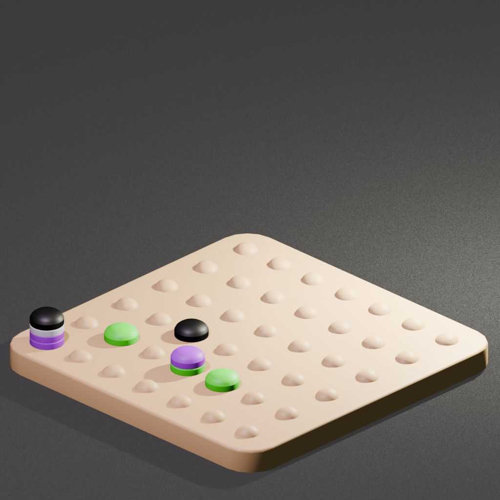
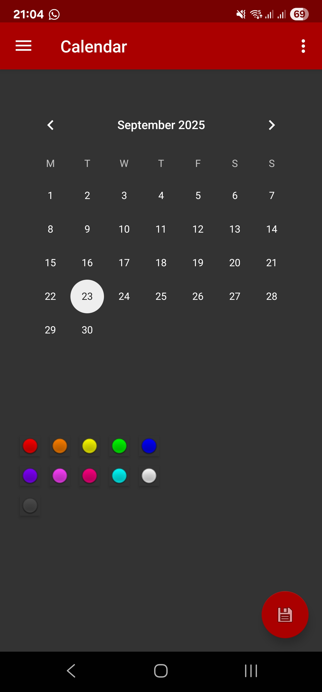

# Event Calendar

This low-profile app allows the user to quickly record events using coloured buttons representing different events.
Imagine you want to track each time you went to the grocery store. Once you step foot in the store, you open the app, hit the yellow button, and close the app again. The app will store this event in a dataset. Perhaps your neighbour is loud once again. You open the app, tap the red button, and close it again. You can export the data to perform analysis on it.

## First flutter project
I have made this application before using android studio. This was ages ago and I had since abandoned it. Now I want to explore flutter and thought remaking this application would be a great way to do it. What drew me to flutter were the rendering capabilities because I want to play around with some 3D effects once the base application works.

## Timeline
Must haves:
- A calendar showing the current month, highlighting the current day, and a way to tell if events occurred that day.
- Coloured buttons. Pressing one will log an event
- An event holds DateTime timestamp and type. Nothing more, nothing less
- A way to export the data into a JSON dataset.
- A way to clear the data

Should haves:
- A way to import an existing dataset
- A way to hide or show more colour buttons on the dashboard (default has ~6 active buttons but more are available once an edit-mode is entered)
- Ability to view previous months on the dashboard by sliding horizontally
- (Satisfying) sound on button presses
- Android widget support to add coloured buttons to home screens

Could haves:
- 3D graphics overhaul, orthographic view
- Using 3D graphics, show all events as stacks of discs on the calendar.
- Upon touching a button, a disc is dropped on top of the calendar.

### Concept

